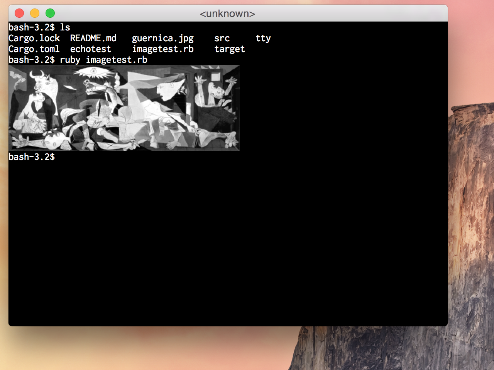

# notty - not a typewriter

__notty__ is a virtual terminal like xterm, gnome-vte, sh, or rxvt. Unlike
these programs, __notty__ is not intended to emulate a DEC VT-series physical
video terminal, or any other physical device. Instead, __notty__ is an
experimental project to bring new features to the command-line which would not
have been possible for the physical terminals other terminals emulate.

Current command-line tools have stagnated (if you prefer, 'stabilized') around
the ECMA-48/ISO 6429/ANSI X3.64 escape code protocol, which is defined on the
basis of the capabilities of 1980s video terminal devices. Essentially all
terminals in use today are virtual terminals being run on devices which are
significantly more capable than these ancient machines, and yet the terminal
environment has not kept pace with these developments. The last revision of the
ANSI escape code protocol was released in 1991.

__notty__ will attempt to remain true to the text-oriented, command-line user
interface of the terminal while extending it to include new and more powerful
interface features, such as:

* Full support for rich text formatting, including 24-bits of color.
* Full and correct support for all of Unicode.
* Lossless keyboard input.
* Inline media content, including raster graphics and structured data.
* Dropdown menus, tooltips, and other features which do not strictly reside in
  the character grid.
* Local echo and retained off-screen character grid state to reduce the need
  for the tty to transmit data back to the terminal.
* Subdividing the character grid to enable more complex interface layouts
  without repeatedly reimplementing that logic in the controlling process.
* And more! If you know any features you wish the terminal had, please open an
  issue and let's talk about this.

Many of these features are not yet implemented.

To achieve these ends, __notty__ will implement a new and more consistent escape
protocol than ANSI escape codes. This protocol will be comparatively easy to
extend with new features as the project grows. Once a feature set has been
stabilized, I will write a framework for creating terminal applications that
use __notty__'s features, written against this protocol (allowing other
terminals to implement the protocol and support these features as well). This
framework will include a polyfill for approximating these features as well as
possible in terminals that don't implement notty codes.

This repository is a library which defines an engine for translating both ANSI
and __notty__ escape codes into state changes in the terminal's abstract state.
This library does not directly implement any means of drawing the state to the
screen and is agnostic about the interface it uses to communicate with the
controlling process, so hopefully it will be reusable for writing terminals in
different graphical environments, for writing screen/tmux-like server-side
multi-terminal managers, and for writing SSH clients in non-UNIX environments.
Because it implements (most) ANSI escape codes, this terminal is backwards
compatible with existing command line tools.

A subdirectory, named scaffolding, contains a minimal graphical terminal using
GTK/pango/cairo, intended for testing __notty__'s features interactively. This
terminal is buggy and feature poor and not intended for general use.

A major difference between __notty__ and other projects in the same space is
that this is _just_ a virtual terminal, and is fully backwards compatible with
the existing shell/terminal setup. It does not implement any features of a
shell, and it is not attempting to totally supplant any existing paradigms.
Graphical terminals based on this library should be useable as drop-in
replacements for other terminals, but with new features that can be used to
implement better interfaces for command line programs such as shells, text
editors, and other utilities.

That said, terminals as they exist today are a pile of ugly kludges. From the
kernel's tty/pty subsystem, to the termios ioctl calls which control it, to the
terminfo and termcap databases, to the ANSI escape codes they describe, to the
ancient codebases of the terminal emulators themselves, this is a universe of
arcane and poorly documented old growth code, much of which is no longer
actively useful to people in the 21st century - your system ships with a terminfo db page
for more than 2500 different terminal devices, nearly all of them extinct, and
every new console you open has a baud rate set in the kernel, even though it
exchanges data in memory. More advanced features of __notty__ will certainly
requiring sidestepping this system to a certain extent: the current plan is to
implement a command to "switch" notty to an extended mode; in such a mode, only
notty escape codes would be used and the tty's flags would all be unset except
for CREAD and ISIG (and maybe not even ISIG).

This implementation is written in [Rust][rust], an exciting new systems
language from Mozilla.

Much thanks to __Thomas E. Dickey__, the maintainer of xterm,
[whose website][invis-island] hosts excellent documentation regarding xterm's
behavior, and to __Paul Flo Williams__, who maintains [vt100.net][vt100],
which hosts manuals for the actual DEC VT-series terminals. Credit also to
__Gary Bernhardt__, whose talk [A Whole New World][anterminal] influenced me to
pursue this project seriously.

# License

__notty__ is free software: you can redistribute it and/or modify it under the
terms of the __GNU Affero General Public License__ as published by the Free
Software Foundation, either __version 3__ of the License, or (at your option)
any later version.

This program is distributed in the hope that it will be useful, but __WITHOUT
ANY WARRANTY__; without even the implied warranty of __MERCHANTABILITY__ or
__FITNESS FOR A PARTICULAR PURPOSE__.  See the GNU Affero General Public
License for more details.

You should have received a copy of the GNU Affero General Public License
along with this program.  If not, see <http://www.gnu.org/licenses/>.

# Conduct

The __notty__ project is committed to upholding the
[Rust Code of Conduct][rust-coc]. Please see CONDUCT.md for more information.

[anterminal]: https://destroyallsoftware.com/talks/a-whole-new-world
[invis-island]: http://invisible-island.net/xterm
[rust]: https://www.rust-lang.org
[rust-coc]: https://www.rust-lang.org/conduct.html
[vt100]: http://vt100.net
